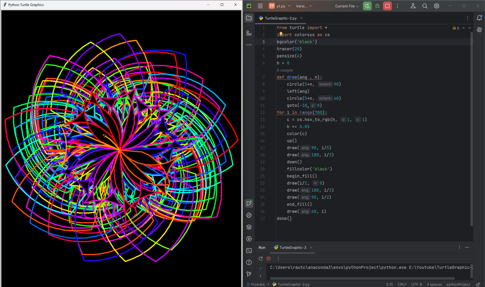

# Cosmic Flower
A mesmerizing Python script that generates a beautiful, cosmic flower-like pattern using the Turtle graphics library. The Cosmic Flower is a stunning display of color and motion, perfect for art, design, and coding enthusiasts.

# Tutorial is available on youtube channel 
click on the link to see :- ([Open in Youtube](https://youtu.be/KOO_w1PN7-4))

# Screenshot

Cosmic Flower

# Features:

Generates a beautiful, intricate flower-like pattern with a range of colors
Uses the Turtle graphics library for a retro, nostalgic feel
Adjustable parameters for customization and experimentation
Perfect for art, design, and coding enthusiasts alike

# Getting Started:

Clone the repository to your local machine
Run the cosmic_flower.py script using Python 3.x
Watch as the Cosmic Flower comes to life on your screen!
Contributing:

Feel free to modify the script, experiment with different colors and patterns, and share your creations with the community! Pull requests are welcome.

# License:

This repository is licensed under the MIT License. See LICENSE for details.

The Cosmic Flower is a great example of how code can be used to create visually stunning and engaging patterns. The use of the colorsys library to generate a range of colors adds an extra layer of depth and complexity to the design, making it perfect for art and design enthusiasts. The intricate details and swirling motions of the flower-like pattern make it a truly unique and captivating creation.
